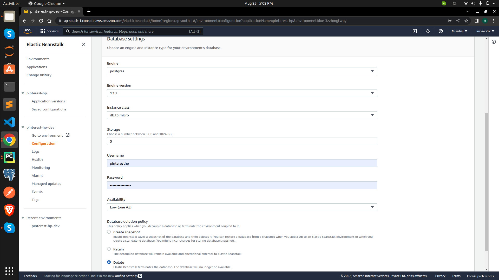

# Deploying a Flask Application to Elastic Beanstalk

***

- We'll be deploying a Flask application called Pinterest-Clone in this tutorial.

## Project Setup

- Your project structure must follow below project structure

&nbsp;**.**\
├── application.py\
├── init_db.py\
├── ***migrations***\
│ &nbsp;&nbsp; &nbsp; &nbsp;├── alembic.ini\
│ &nbsp;&nbsp; &nbsp; &nbsp;├── env.py\
│ &nbsp;&nbsp; &nbsp; &nbsp;├── README\
│ &nbsp;&nbsp; &nbsp; &nbsp;├── script.py.mako\
│ &nbsp;&nbsp; &nbsp; &nbsp;└── versions\
│&nbsp;&nbsp; &nbsp; &nbsp; &nbsp;&nbsp; &nbsp; &nbsp;├── 00fa0739d225_make_board_private.py\
│&nbsp;&nbsp; &nbsp; &nbsp; &nbsp;&nbsp; &nbsp; &nbsp;└── __pycache__\
│&nbsp;&nbsp; &nbsp; &nbsp; &nbsp; &nbsp; &nbsp;&nbsp;&nbsp; &nbsp; &nbsp; ├──
00fa0739d225_make_board_private.cpython-38.pyc\
├── pinterest\
│ &nbsp;&nbsp; &nbsp; &nbsp;├── **admin**\
│ &nbsp;&nbsp; &nbsp; &nbsp;│&nbsp;&nbsp; &nbsp; &nbsp; ├── form.py\
│ &nbsp;&nbsp; &nbsp; &nbsp;│&nbsp;&nbsp; &nbsp; &nbsp; ├── routes.py\
│ &nbsp;&nbsp; &nbsp; &nbsp;│&nbsp;&nbsp; &nbsp; &nbsp; └── utils.py\
│ &nbsp;&nbsp; &nbsp; &nbsp;├── config.py\
│ &nbsp;&nbsp; &nbsp; &nbsp;├── __init__.py\
│ &nbsp;&nbsp; &nbsp; &nbsp;├── **main**\
│ &nbsp;&nbsp; &nbsp; &nbsp;│&nbsp;&nbsp; &nbsp; &nbsp; ├── form.py\
│ &nbsp;&nbsp; &nbsp; &nbsp;│&nbsp;&nbsp; &nbsp; &nbsp; ├── __init__.py\
│ &nbsp;&nbsp; &nbsp; &nbsp;│&nbsp;&nbsp; &nbsp; &nbsp; ├── routes.py\
│ &nbsp;&nbsp; &nbsp; &nbsp;│&nbsp;&nbsp; &nbsp; &nbsp; └── utils.py\
│ &nbsp;&nbsp; &nbsp; &nbsp;├── models.py\
│ &nbsp;&nbsp; &nbsp; &nbsp;├── msg.py\
│ &nbsp;&nbsp; &nbsp; &nbsp;├── **pins**\
│ &nbsp;&nbsp; &nbsp; &nbsp;│&nbsp;&nbsp; &nbsp; &nbsp; ├── form.py\
│ &nbsp;&nbsp; &nbsp; &nbsp;│&nbsp;&nbsp; &nbsp; &nbsp; ├── __init__.py\
│ &nbsp;&nbsp; &nbsp; &nbsp;│&nbsp;&nbsp; &nbsp; &nbsp; ├── routes.py\
│ &nbsp;&nbsp; &nbsp; &nbsp;│&nbsp;&nbsp; &nbsp; &nbsp; └── utils.py\
│ &nbsp;&nbsp; &nbsp; &nbsp;├── **static**\
│ &nbsp;&nbsp; &nbsp; &nbsp;│&nbsp;&nbsp; &nbsp; &nbsp; ├── css\
│ &nbsp;&nbsp; &nbsp; &nbsp;│&nbsp;&nbsp; &nbsp; &nbsp; │&nbsp;&nbsp; &nbsp; &nbsp; ├── style.css\
│ &nbsp;&nbsp; &nbsp; &nbsp;│&nbsp;&nbsp; &nbsp; &nbsp; │&nbsp;&nbsp; &nbsp; &nbsp; └── virtual-select.min.css\
│ &nbsp;&nbsp; &nbsp; &nbsp;│&nbsp;&nbsp; &nbsp; &nbsp; ├── js\
│ &nbsp;&nbsp; &nbsp; &nbsp;│&nbsp;&nbsp; &nbsp; &nbsp; │&nbsp;&nbsp; &nbsp; &nbsp; ├── script.js\
│ &nbsp;&nbsp; &nbsp; &nbsp;│&nbsp;&nbsp; &nbsp; &nbsp; │&nbsp;&nbsp; &nbsp; &nbsp; └── virtual-select.min.js\
│ &nbsp;&nbsp; &nbsp; &nbsp;│&nbsp;&nbsp; &nbsp; &nbsp; ├── pin_img\
│ &nbsp;&nbsp; &nbsp; &nbsp;│&nbsp;&nbsp; &nbsp; &nbsp; │&nbsp;&nbsp; &nbsp; &nbsp; ├── 04e6a8b459b4a7d0.png\
│ &nbsp;&nbsp; &nbsp; &nbsp;│&nbsp;&nbsp; &nbsp; &nbsp; │&nbsp;&nbsp; &nbsp; &nbsp; ├── 2a999f8e479b1f86.png\
│ &nbsp;&nbsp; &nbsp; &nbsp;│&nbsp;&nbsp; &nbsp; &nbsp; │&nbsp;&nbsp; &nbsp; &nbsp; └── 588b87a182d95d2c.png\
│ &nbsp;&nbsp; &nbsp; &nbsp;│&nbsp;&nbsp; &nbsp; &nbsp; ├── profile_img\
│ &nbsp;&nbsp; &nbsp; &nbsp;│&nbsp;&nbsp; &nbsp; &nbsp; │&nbsp;&nbsp; &nbsp; &nbsp; ├── default.jpg\
│ &nbsp;&nbsp; &nbsp; &nbsp;│&nbsp;&nbsp; &nbsp; &nbsp; │&nbsp;&nbsp; &nbsp; &nbsp; └── f56b5c86131a8cec.png\
│ &nbsp;&nbsp; &nbsp; &nbsp;│&nbsp;&nbsp; &nbsp; &nbsp; └── web_static\
│ &nbsp;&nbsp; &nbsp; &nbsp;│&nbsp;&nbsp; &nbsp; &nbsp; &nbsp;&nbsp;&nbsp; &nbsp; &nbsp; └── logo.png\
│ &nbsp;&nbsp; &nbsp; &nbsp;├── **templates**\
│ &nbsp;&nbsp; &nbsp; &nbsp;│&nbsp;&nbsp; &nbsp; &nbsp; ├── admin_block_user.html\
│ &nbsp;&nbsp; &nbsp; &nbsp;│&nbsp;&nbsp; &nbsp; &nbsp; ├── admin.html\
│ &nbsp;&nbsp; &nbsp; &nbsp;│&nbsp;&nbsp; &nbsp; &nbsp; ├── admin_new_tag.html\
│ &nbsp;&nbsp; &nbsp; &nbsp;│&nbsp;&nbsp; &nbsp; &nbsp; ├── admin_update_tag.html\
│ &nbsp;&nbsp; &nbsp; &nbsp;│&nbsp;&nbsp; &nbsp; &nbsp; ├── admin_user_page.html\
│ &nbsp;&nbsp; &nbsp; &nbsp;│&nbsp;&nbsp; &nbsp; &nbsp; ├── base.html\
│ &nbsp;&nbsp; &nbsp; &nbsp;│&nbsp;&nbsp; &nbsp; &nbsp; ├── board_details.html\
│ &nbsp;&nbsp; &nbsp; &nbsp;│&nbsp;&nbsp; &nbsp; &nbsp; ├── edit_board.html\
│ &nbsp;&nbsp; &nbsp; &nbsp;│&nbsp;&nbsp; &nbsp; &nbsp; ├── home.html\
│ &nbsp;&nbsp; &nbsp; &nbsp;│&nbsp;&nbsp; &nbsp; &nbsp; ├── login.html\
│ &nbsp;&nbsp; &nbsp; &nbsp;│&nbsp;&nbsp; &nbsp; &nbsp; ├── new_board.html\
│ &nbsp;&nbsp; &nbsp; &nbsp;│&nbsp;&nbsp; &nbsp; &nbsp; ├── new_post.html\
│ &nbsp;&nbsp; &nbsp; &nbsp;│&nbsp;&nbsp; &nbsp; &nbsp; ├── pin.html\
│ &nbsp;&nbsp; &nbsp; &nbsp;│&nbsp;&nbsp; &nbsp; &nbsp; ├── profile.html\
│ &nbsp;&nbsp; &nbsp; &nbsp;│&nbsp;&nbsp; &nbsp; &nbsp; ├── register.html\
│ &nbsp;&nbsp; &nbsp; &nbsp;│&nbsp;&nbsp; &nbsp; &nbsp; ├── reset_request.html\
│ &nbsp;&nbsp; &nbsp; &nbsp;│&nbsp;&nbsp; &nbsp; &nbsp; ├── reset_token.html\
│ &nbsp;&nbsp; &nbsp; &nbsp;│&nbsp;&nbsp; &nbsp; &nbsp; ├── search.html\
│ &nbsp;&nbsp; &nbsp; &nbsp;│&nbsp;&nbsp; &nbsp; &nbsp; ├── update_pin.html\
│ &nbsp;&nbsp; &nbsp; &nbsp;│&nbsp;&nbsp; &nbsp; &nbsp; ├── user_board_details.html\
│ &nbsp;&nbsp; &nbsp; &nbsp;│&nbsp;&nbsp; &nbsp; &nbsp; ├── user_followers.html\
│ &nbsp;&nbsp; &nbsp; &nbsp;│&nbsp;&nbsp; &nbsp; &nbsp; ├── user_following.html\
│ &nbsp;&nbsp; &nbsp; &nbsp;│&nbsp;&nbsp; &nbsp; &nbsp; └── user_profile.html\
│ &nbsp;&nbsp; &nbsp; &nbsp;└── **users**\
│&nbsp;&nbsp; &nbsp; &nbsp; &nbsp;&nbsp;&nbsp; &nbsp; &nbsp; ├── form.py\
│&nbsp;&nbsp; &nbsp; &nbsp; &nbsp;&nbsp;&nbsp; &nbsp; &nbsp; ├── __init__.py\
│&nbsp;&nbsp; &nbsp; &nbsp; &nbsp;&nbsp;&nbsp; &nbsp; &nbsp; ├── routes.py\
│&nbsp;&nbsp; &nbsp; &nbsp; &nbsp; &nbsp;&nbsp; &nbsp; &nbsp;└── utils.py\
├── Procfile\
├── requirements.txt\
├── runtime.txt\
└── **tests**\
&nbsp;&nbsp; &nbsp; &nbsp; &nbsp; ├── __pycache__\
&nbsp;&nbsp; &nbsp; &nbsp; &nbsp; │&nbsp;&nbsp; &nbsp; &nbsp; &nbsp; └── test_app.cpython-38-pytest-7.1.2.pyc\
&nbsp;&nbsp; &nbsp; &nbsp; &nbsp; └── test_app.py

\
Make sure you are working with virtual environment if not than Create a new virtual environment and activate it:

```
python3 - m venv venv & & source venv/bin/activate
```

Create requirements.txt:

```
pip freeze > requirements.txt
```

## Elastic Beanstalk CLI

- Be sure to [register](https://portal.aws.amazon.com/billing/signup#/start/email) for an AWS account before continuing.
  By creating an account you might also be eligible for the AWS Free Tier.

- The Elastic [Beanstalk command line interface](https://docs.aws.amazon.com/elasticbeanstalk/latest/dg/eb-cli3.html) (
  EB CLI) allows you to perform a variety of operations to deploy and manage your Elastic Beanstalk applications and
  environments.
- There are two ways of installing EB CLI:
    1. Via the [EB CLI installer](https://github.com/aws/aws-elastic-beanstalk-cli-setup#2-quick-start)
    2. With [pip (awsebcli)](https://pypi.org/project/awsebcli/)
- > It's recommended to install the EB CLI globally (outside any specific virtual environment).

After you've installed the EB CLI, you can check the version by running:

```
eb --version
```

> Before initialize elastic beanstalk add **.ebignore** file within the project root directory.

## Initilize Elastic Beanstalk

- Within the project root run:

```
eb init
```

> You'll be prompted with a number of questions which is listed below.

### Select a default region

- The AWS region of your Elastic Beanstalk environment (and resources). If you're not familiar with the different AWS
  regions, check
  out [AWS Regions and Availability Zones](https://aws.amazon.com/about-aws/global-infrastructure/regions_az/).
  Generally, you should pick the region that's closest to your
  customers. Keep in mind that resource prices vary from region to region.

### Enter Application Name

- This is the name of your Elastic Beanstalk application. You can enter application name. I recommend just pressing
  enter and going with the default application name.

### Platform and platform branch

- It appears you are using Python. Is this correct?(Y/n)
    - It is Python Flask application so enter "Y".

- Select a platform branch.
    - It'll give you different Python versions and Amazon Linux versions you can work with. Pick "Python 3.8 running on
      64bit Amazon Linux 2".

### Do you want to set up SSH for your instances?

- [AWS CodeCommit](https://aws.amazon.com/codecommit/) is a secure, highly scalable, managed source control service that
  hosts private Git repositories. It makes it easy for teams to securely collaborate on code with contributions
  encrypted in transit and at rest.
- We won't be using it since we're already using GitHub/Gitlab for source control. So say "no".

\
After you answer all the questions, you'll notice a hidden directory inside your project root named ".elasticbeanstalk".
The directory should contain a config.yml file, with all the data you've just provided.

```
.elasticbeanstalk
└── config.yml
```

The file should contain something similar to:

```
branch-defaults:
  default:
    environment: null
    group_suffix: null
global:
  application_name: pinterest-hp
  branch: null
  default_ec2_keyname: null
  default_platform: Python 3.8 running on 64bit Amazon Linux 2
  default_region: ap-south-1
  include_git_submodules: true
  instance_profile: null
  platform_name: null
  platform_version: null
  profile: eb-cli
  repository: null
  sc: null
  workspace_type: Application
```

## Create Elastic Beanstalk environment and deploy

For creating the elastic beanstalk environment and deploy the application run following command within your root project
directory.

```
eb create
```

Again, you'll be prompted with a few questions.

### Environment Name

- This represents the name of the EB environment. I'd recommend sticking with the default because It's considered good
  practice to add -env suffix to your environments.

### Enter DNS CNAME prefix

- Again go with the default name and press Enter.

### Select a load balancer type

- A load balancer distributes traffic amongst your environment's instances. Select "application".

### Spot Fleet Requests

- Spot Fleet requests allow you to launch instances on-demand based on your criteria. We won't be using them in this
  tutorial, so say "no". To learn more about spot fleet
  requests [Click Here](https://docs.aws.amazon.com/AWSEC2/latest/UserGuide/spot-fleet.html).

## Configure an Environment

- After completing above steps if you try to access application from EB(elastic beanstalk) it returned `502 Bad Gateway`
  . There are two reason behind this error.
    1. Python needs `PYTHONPATH` in order to find modules in our application.
    2. By default, Elastic Beanstalk attempts to launch the WSGI application from application.py, which doesn't exist.

> By default Elastic Beanstalk serves Python applications with Gunicorn. EB automatically installs Gunicorn in the
> deployment process, hence we do not have to add it to requirements.txt.

**Let's fix these errors.**

- Your application entrypoint file name must be **application.py**. In that file you have to add host ip address like that.
```
if __name__ == '__main__':
    application.run(debug=False, host='0.0.0.0')
```


Create a new folder in the project root called ".ebextensions". Within the newly created folder create a file named
01_flask.config:

```python
option_settings:
  aws: elasticbeanstalk:application: environment:
    PYTHONPATH: "/var/app/current:$PYTHONPATH"
  aws: elasticbeanstalk:container: python:
    WSGIPath: "application:application"
```

> How do EB .config files work?
>   1. You can have as many as you want.
>   2. They are loaded in the following order: 01_x, 02_x, 03_x, etc.
>   3. You do not have to memorize these settings; you can list all your environmental settings by running `eb config`.

Next, we have to tell Elastic Beanstalk to initialize the database when a new application version gets deployed. Add the
following to the end of .ebextensions/01_flask.config:

```python
container_commands:
01_initdb:
  command: "source /var/app/venv/*/bin/activate && python3 init_db.py"
  leader_only: true
```

> The EB environment will now execute the above command every time we deploy a new application version. We used
> leader_only, so only the first EC2 instance executes them (in case our EB environment runs multiple EC2 instances).
> 1. Commands run before the application and web server are set up and the application version file is extracted.
> 2. Container_commands run after the application and web server have been set up and the application version archive
     has
     > been extracted, but before the application version is deployed (before the files are moved from the staging
     folder to
     > their final location).

## Configure RDS

- For creating postgresql RDS instance go to your environments > Configuration. In that select Database **Edit** option.
- Set configurations follow below snapshot and hit Apply button. It may take few seconds.
  

## Set Environments Configurations for application.

For creating your application software config file refer `pinterest/config.py` file.

- For configure your software configurations go to your environments > configuration and hit software `edit` button.
- In `Environment properties` add your environments variables and it's values.

> for setting up your postgres database environment variables refer
> this [Page](https://docs.aws.amazon.com/AmazonRDS/latest/UserGuide/USER_ConnectToPostgreSQLInstance.html).

### Debugging EB

- When working with Elastic Beanstalk, it can be pretty frustrating to figure out what went wrong if you don't know how
  to access the log files.
- For getting last 100 logs run: `eb logs`
- If you want to do this by Web view than go to your environments > logs and click `Request logs` and you can also
  download this log file.

> - In case if you are facing error related to database models(Like database migration errors.)
> - you can add migration commands in **init_db.py** file.
> - If database is not created in Postgres RDS you can add those commands in **init_db.py** too.

example:-
```python
from pinterest import db, create_app
db.create_all(app=create_app())
```